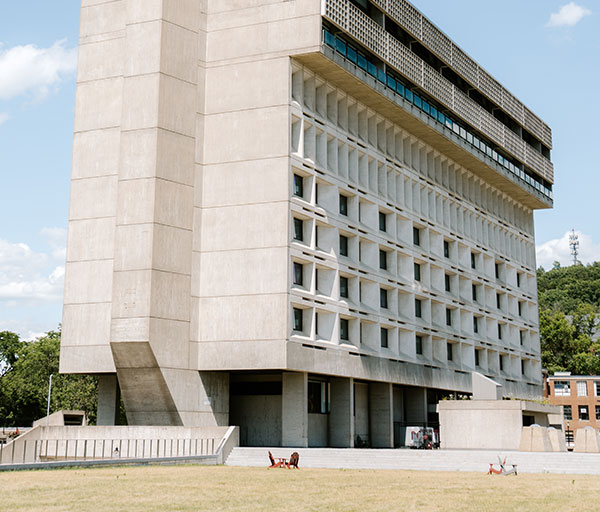
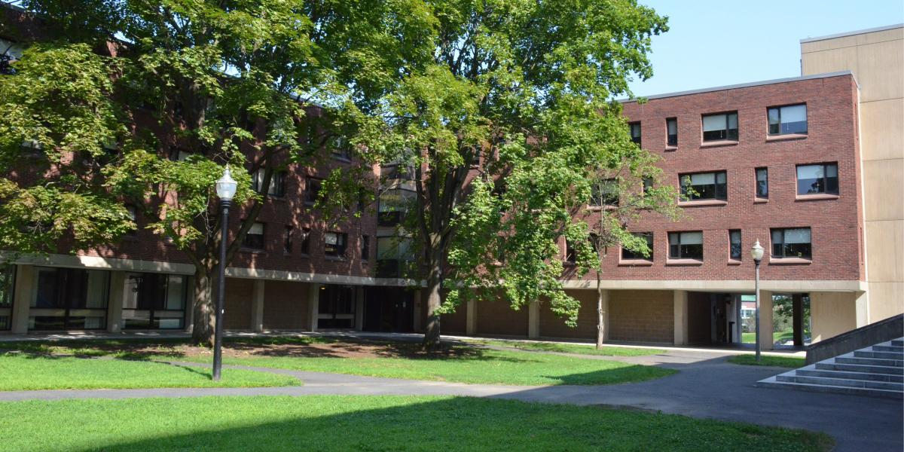
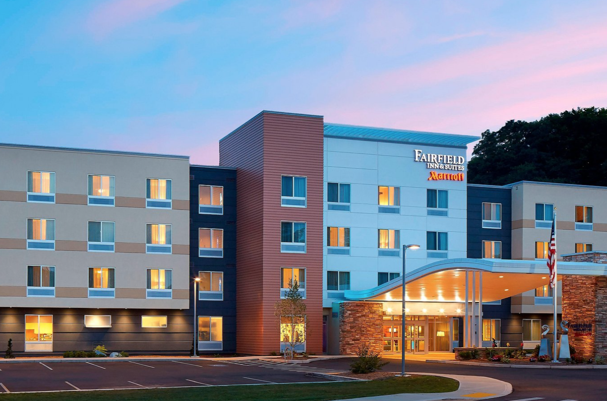
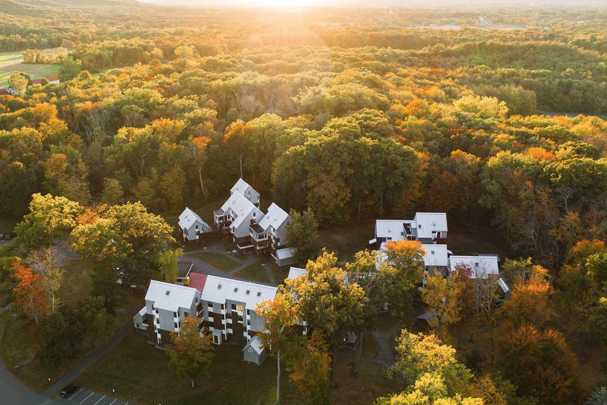

## On-Campus Lodging

On-Campus lodging is the preferred housing option at RLC.

#### [UMass Residence Hall - North Residential](https://www.umass.edu/living/residence/north)
[52-58 Eastman Lane, Amherst MA](https://maps.app.goo.gl/txjjmN8Z7mppkMBN6)

<ul>
<li><strong>Rates</strong>: $75 per night</li>
<li><strong>How to book</strong>: Through the RLC/UMass registration system</li>
<li><strong>Number of rooms available</strong>: 230</li>
</ul>

---

#### [UMass Hotel](https://hotelumass.com/)
[1 Campus Center Way, Amherst, MA](https://maps.app.goo.gl/6aPDpCpj936B5u3G7)

<ul>
    <li><strong>Rates</strong>: from $179 to $279 per night, depending on the day of the week and number of beds</li>
    <li><strong>How to book</strong>: Through the RLC/UMass registration system</li>
    <li><strong>Number of rooms</strong>: approximately 100</li>
</ul>

---

#### [UMass - Traditional Dorm Rooms](https://www.umass.edu/living/residence-halls/undergraduate-housing)
[University of Massachusetts Amherst Campus](https://maps.app.goo.gl/4NXUL2WFB2cd4vLX9)

<ul>
    <li><strong>Rates</strong>: $55 per night</li>
    <li><strong>How to book</strong>: Through the RLC/UMass registration system</li>
    <li><strong>Number of rooms available</strong>: approximately 30</li>
</ul>

## Off-Campus Lodging

#### [Hotel Northampton](https://www.hotelnorthampton.com/)
[36 King Street, Northampton, MA](https://maps.app.goo.gl/cGyeyxWMhznztt6p6)

<ul>
    <li><strong>Rates</strong>: from $149 to $259 per night, depending on the day of the week and number of beds</li>
    <li><strong>How to book</strong>: Call <a href="tel:413-584-3100">413-584-3100</a>. Let them know this is a reservation to attend the Reinforcement Learning Conference - UMass.</li>
    <li><strong>Last day to make a reservation through RLC</strong>: July 8 (rooms may be available after this date but are not guaranteed)</li>
    <li><strong>Number of rooms available</strong>: 10</li>
</ul>

---

#### [Hampton Inn (Hadley)](https://www.hilton.com/en/hotels/hadmahx-hampton-hadley-amherst-area/)
[24 Bay Road. Hadley, MA](https://maps.app.goo.gl/y4SGMYzxJs5neEQU7)

<ul>
    <li><strong>Rates</strong>: approximately $200 per night</li>
    <li><strong>How to book</strong>: <a href="https://www.hilton.com/en/book/reservation/rooms/?ctyhocn=HADMAHX&arrivalDate=2024-08-09&departureDate=2024-08-12&groupCode=CHH90G&room1NumAdults=1&cid=OM%2CWW%2CHILTONLINK%2CEN%2CDirectLink">Booking link</a></li>
    <li><strong>Last day to make a reservation through RLC</strong>: July 12 (rooms may be available after this date but are not guaranteed)</li>
    <li><strong>Number of rooms available</strong>: 10</li>
</ul>

---

#### [Fairfield Inn (Northampton)](https://www.marriott.com/en-us/hotels/bdlnh-fairfield-inn-and-suites-springfield-northampton-amherst/overview/)
[115A Conz St, Northampton, MA](https://maps.app.goo.gl/1ZGu2tMSJJ2VbtCPA)

<ul>
    <li><strong>Rates</strong>: from $139 to $259 per night, depending on the day of the week and number of beds</li>
    <li><strong>How to book</strong>: Call <a href="tel:413-587-9800">413-587-9800</a>. Let them know this is a reservation to attend the Reinforcement Learning Conference or provide the agent with the block code "UMAC".</li>
    <li><strong>Last day to make a reservation through RLC</strong>: July 8 (rooms may be available after this date but are not guaranteed)</li>
    <li><strong>Number of rooms available</strong>: 10</li>
</ul>

---

### [Hampshire College Residence Halls](https://www.hampshire.edu/student-life/residence-life-and-housing/residences)
[Hampshire College campus](https://maps.app.goo.gl/JMnB9ZzkZdVZVyut7). The address of the particular dorm will be available upon registration.

<ul>
    <li><strong>Rates</strong>: $85 per night</li>
    <li><strong>How to book</strong>: Through the RLC/UMass registration system.</li>
    <li><strong>Last day to make a reservation through RLC</strong>: July 26</li>
    <li><strong>Number of rooms available</strong>: 120</li>
</ul>

